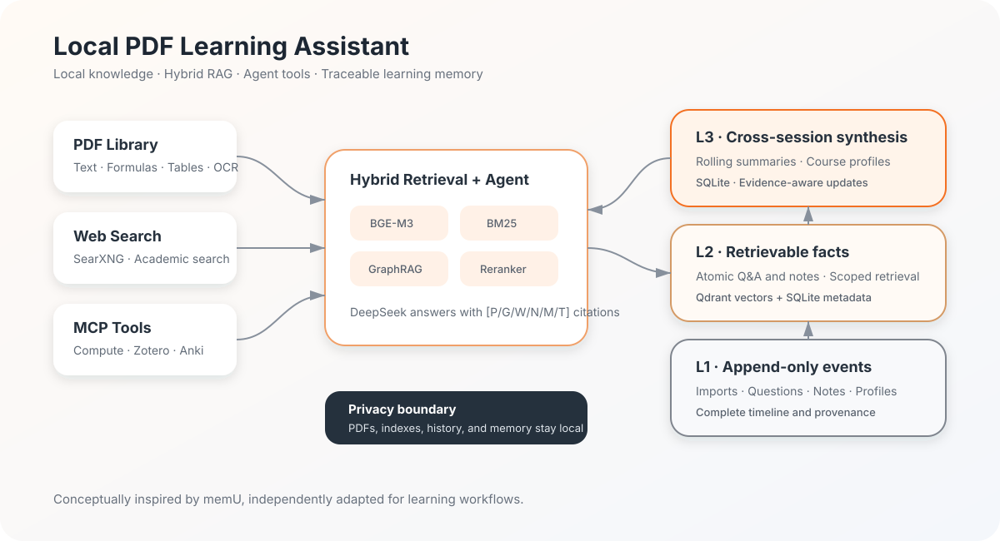

# PDF Learning Assistant

<p align="center">
  <a href="README.md"></a>
  <a href="README.en.md"></a>
</p>

[](https://www.python.org/)
[](LICENSE)
[](https://docs.astral.sh/ruff/)

A local-first PDF question-answering app for studying mathematics, statistics, and data analysis. Upload one or more PDFs, build an on-device knowledge base, and ask DeepSeek for answers with page-level citations.

> In one sentence: turn local PDFs into a personal learning agent that cites its sources, remembers your learning journey, and can use calculation and literature tools.



## Tech stack

| Area | Technology |
| --- | --- |
| Web UI | Gradio |
| LLM and agent | DeepSeek (OpenAI-compatible API), MCP |
| PDF parsing | PyMuPDF, optional Tesseract OCR |
| Vector and hybrid retrieval | BGE-M3, Qdrant, BM25, optional BGE Reranker |
| Knowledge graph | Local Fast GraphRAG based on entity co-occurrence |
| Data and memory | SQLite, Qdrant |
| Web and academic search | SearXNG, arXiv, OpenAlex, Crossref |
| Learning tools | Zotero, Anki, Python/SymPy |

## Features

- Multi-PDF upload, SHA-256 deduplication, and local persistence
- Document folders for course-level organization and batch moves
- Page-aware PyMuPDF parsing and structured chunking
- Formula lines, Markdown tables, page graphics detection, and Chinese/English OCR evidence
- Local BGE-M3 vector search combined with BM25 lexical search
- Local Fast GraphRAG with concepts, formulas, co-occurrence edges, neighbor expansion, and page provenance
- Optional BGE reranking
- DeepSeek answers with PDF page citations
- PDF-only, PDF + web, and web-only modes
- Local SearXNG search integration
- Automatic rewriting of follow-up questions into standalone retrieval queries
- Local vector memory over prior Q&A and study notes
- Current-session and cross-session memory scopes
- Folder-scoped PDFs, notes, history, and learning profiles
- Per-course learning profiles with evidence-aware weak-point inference
- Rolling summaries for long conversations
- Separate `[P]`, `[G]`, `[W]`, `[N]`, `[M]`, and `[T]` citations for PDF, graph, web, notes, memory, and tools
- DeepSeek tool calling with an explicit registry, tool-group policies, duplicate-call protection, and up to four tool rounds
- Sandboxed Python/SymPy calculations and formula checks
- arXiv, OpenAlex, and Crossref academic search
- Restricted learning-file access and read-only SQLite queries
- Read access to Zotero libraries, tags, notes, and citations
- Read/write Anki operations only when explicitly requested
- Local SQLite history, notes, sessions, statistics, and Markdown/JSON study reports

## Quick start

### Requirements

Python 3.11–3.13 is supported; Python 3.12 is recommended. The original setup was tuned for an Apple M4 with 16 GB unified memory: DeepSeek handles generation while parsing, BGE-M3 embeddings, retrieval, and storage stay local.

### 1. Install Python 3.12

On macOS with Homebrew:

```bash
brew install python@3.12
python3.12 --version
```

### 2. Create an environment and install dependencies

```bash
python3.12 -m venv .venv
source .venv/bin/activate
python -m pip install --upgrade pip
python -m pip install -r requirements.txt
```

The first install and the first PDF ingestion need network access to download dependencies and BGE-M3.

For tests and linting, install the project with development dependencies instead:

```bash
python -m pip install -e ".[dev]"
```

### 3. Configure DeepSeek

```bash
cp .env.example .env
```

Then edit `.env`:

```dotenv
DEEPSEEK_API_KEY=your_deepseek_api_key
DEEPSEEK_BASE_URL=https://api.deepseek.com
DEEPSEEK_MODEL=deepseek-v4-flash
```

Never share or commit `.env`. PDF ingestion and indexing work without an API key, but answer generation does not.

### 4. Run

```bash
source .venv/bin/activate
PYTHONPATH=src python app.py
```

The app opens at `http://127.0.0.1:7860`.

After cloning or downloading the project from GitHub, restore the launcher permissions:

```bash
chmod +x start.command start-search.command
```

On macOS, after installation you can double-click `start.command`. It starts Docker Desktop, SearXNG, and the assistant, and also attempts to open Zotero and Anki if installed. Use `start-search.command` when you only want to manage SearXNG.

### 5. Use the assistant

1. Open **Knowledge Center**.
2. Create or select a folder, then choose one or more text-based PDFs.
3. Expand **Knowledge Base Management** and select **Parse and add to Knowledge Center**.
4. Wait for `BAAI/bge-m3` to download and finish the first index.
5. Return home and choose the model, course, search mode, memory scope, PDFs, and tools.
6. Ask a question. Evidence is marked as `[P1]`, `[P2]`, and so on, with document and page details.
7. Press `Enter` to send and `Shift + Enter` for a new line.

### Memory and context behavior

- Follow-up questions are rewritten using the rolling summary and the latest four Q&A turns.
- **Current conversation only** prevents long-term memory from crossing sessions; **All history** explicitly enables cross-session retrieval.
- Folder context applies the same course boundary to PDFs and memories.
- Memory vectors stay in local Qdrant while auditable metadata stays in SQLite.
- After a conversation exceeds four turns, every six uncompressed older turns trigger a rolling summary update.
- Learning profiles can be edited manually or inferred from local history and notes.
- Each document folder has an independent course profile. Weak points are updated only when repeated confusion is supported by evidence.

## Three-layer learning memory

The conceptual backbone is inspired by the open-source
[NevaMind-AI/memU](https://github.com/NevaMind-AI/memU) model:
`Resource → Memory Item → Memory Category`. This project borrows the ideas of layering, aggregation, and traceability. It does not depend on memU at runtime or copy its implementation; the memory system is independently implemented for PDF-based learning.

| This project | Stores | Related memU idea | Purpose |
| --- | --- | --- | --- |
| L1 · Append-only learning events | Document imports, Q&A completion, notes, profile updates | Resource / raw source | Preserve a timeline and uncompressed provenance |
| L2 · Retrievable learning facts | Q&A, rewritten queries, and notes | Memory Item / atomic memory | Embed facts with BGE-M3 and recover relevant learning context |
| L3 · Cross-session synthesis | Rolling summaries, course profiles, weak points, and preferences | Memory Category / aggregated memory | Provide compact, durable context for long and cross-session learning |

### Learning-focused improvements

- **Course isolation:** document folders provide one shared scope for PDFs, notes, history, and profiles.
- **Explicit cross-session control:** users choose whether retrieval stays in the current conversation or includes all history.
- **Dual storage and rebuildable indexes:** SQLite keeps auditable metadata; Qdrant keeps vectors that can be rebuilt from L2 records.
- **Progressive compression:** the latest four turns remain verbatim while older turns are summarized in batches with an exact coverage cursor.
- **Evidence-aware profiles:** weak points, explanation depth, mathematical style, and preferences are updated per course only when supported.
- **End-to-end provenance:** L1 events link to L2 facts, which link to L3 summaries or profiles; the UI renders the resulting memory graph.
- **Memory/evidence separation:** memory restores learning context, while answers remain grounded in PDF, graph, web, or tool evidence with distinct citation labels.

This is a learning-specific reinterpretation, so the L1/L2/L3 names here do not map one-to-one to the internal layer numbering in the current memU codebase.

## PDF formulas, tables, and page images

- Text, formulas, tables, and page-image descriptions become separate retrieval chunks while retaining page numbers.
- Tables are converted to Markdown for row, column, value, and statistic comparisons.
- Pages with embedded images, dense vector graphics, or scans are rendered under `data/page_assets`.
- Tesseract uses `chi_sim+eng`; set `ENABLE_PAGE_OCR=false` to disable OCR.
- The current DeepSeek chat endpoint receives text, not entire PDFs. It sees the question, learning context, and a small set of retrieved evidence chunks.

## Local GraphRAG

- Build or rebuild it from the **Local GraphRAG** card in Knowledge Center.
- The local pipeline extracts Chinese concepts, English terms, and formulas, then connects entities that co-occur in a chunk.
- Queries match seed entities, expand to neighbors, and return the original PDF chunks and page numbers.
- Graph construction does not call a cloud LLM. Graph evidence is merged into ordinary PDF answers and cited as `[G1]`, `[G2]`, and so on.
- The UI marks the graph stale after PDFs are added or moved; vector/BM25 retrieval continues to work.
- This is a lightweight local implementation tuned for 16 GB Apple Silicon, not Microsoft's full LLM-heavy GraphRAG indexing pipeline.

## Agent and MCP tools

- The `⌘` control under the input selects tool groups available to DeepSeek.
- DeepSeek decides whether to call a tool and may run up to four call/read/reason cycles.
- Tool results use `[T]` citations and appear in the retrieval trace.
- PDF-only mode disables all tools so answers use only selected PDFs.
- Python runs in a restricted subprocess with module allowlists, source checks, resource limits, and a ten-second timeout.
- File tools are confined to `LEARNING_FILES_ROOT`, defaulting to `data/uploads`.
- SQLite opens in `mode=ro` with `query_only` and accepts only one `SELECT` or `WITH` statement.
- Zotero tools are read-only. Anki writes run only for explicit create, update, or scheduling requests.

### Zotero

1. Open Zotero and enable its local API in Advanced Settings.
2. Keep Zotero running.
3. Use **Learning Space → MCP Services → Check all MCP tools**.

Local mode uses `http://127.0.0.1:23119/api` without a cloud key. To use Zotero Web API instead, set `ZOTERO_USER_ID` and a read-only `ZOTERO_API_KEY`.

### Anki

1. In Anki, open **Tools → Add-ons → Get Add-ons**.
2. Install AnkiConnect with code `2055492159`.
3. Restart Anki and keep it running.
4. Check the service in **Learning Space → MCP Services**. The default endpoint is `http://127.0.0.1:8765`.

## Web search

Start SearXNG automatically with `start.command`, or run it separately:

```bash
docker compose -f docker-compose.search.yml up -d
```

The default image is `ghcr.io/searxng/searxng:latest`, and the service binds only to `127.0.0.1:8080`. The published configuration does not assume a proxy. If your network requires one, follow the bilingual comments in `searxng/settings.yml` and enter an address reachable from Docker.

Check the service:

```bash
curl "http://127.0.0.1:8080/search?q=central+limit+theorem&format=json"
```

Stop it with:

```bash
docker compose -f docker-compose.search.yml down
```

## Local data and privacy

```text
data/
├── assistant.sqlite3   # History, notes, metadata, and GraphRAG
├── qdrant/             # Vector indexes
├── reports/            # Study reports
└── uploads/            # Local PDF copies
```

Back up `data/` to preserve the knowledge base. Original PDFs are not uploaded in full. DeepSeek receives the question, conversation summary, learning profile, and a small set of retrieved PDF/web/note/memory chunks. Search terms go to the selected public API or local SearXNG; Zotero cloud mode sends queries to the Zotero API.

## Project layout

```text
.
├── app.py                       # Gradio entry point
├── src/pdf_assistant/
│   ├── assistant.py             # Q&A orchestration, memory, course profiles
│   ├── pdf_parser.py            # PDF, formula, table, and OCR parsing
│   ├── retrieval.py             # BGE-M3 + BM25 + Reranker
│   ├── graph_rag.py             # Local entity co-occurrence GraphRAG
│   ├── database.py              # SQLite data and three-layer memory
│   ├── llm.py                   # DeepSeek prompts and agent loop
│   ├── mcp_client.py            # MCP registry and calls
│   └── ui.py                    # Gradio interface
├── tests/                       # Unit tests
├── requirements.txt            # Runtime dependencies
├── pyproject.toml               # Package and development configuration
└── .env.example                # Environment template
```

## Test

```bash
source .venv/bin/activate
pytest -q
ruff check .
```

## Troubleshooting

- **First upload is slow:** BGE-M3 downloads and loads on first use; later runs use the local cache.
- **DeepSeek is not configured:** confirm that `.env` exists in the project root, then restart the app.
- **Web mode is unavailable:** confirm Docker Desktop and SearXNG are running at `http://127.0.0.1:8080`.
- **High memory pressure on a 16 GB Mac:** keep `EMBEDDING_BATCH_SIZE=4`, avoid running another large local LLM, or set `EMBEDDING_DEVICE=cpu`.

## Open-source notice

This project is released under the [MIT License](LICENSE); an
[unofficial Simplified Chinese translation](LICENSE.zh-CN.md) is included for convenience. Its memory architecture is conceptually inspired by [memU](https://github.com/NevaMind-AI/memU) (Apache-2.0), while the code and learning-focused extensions are independently implemented.

Issues and pull requests are welcome. Never include API keys, private PDFs, local study data, or sensitive screenshots in an issue or log.
