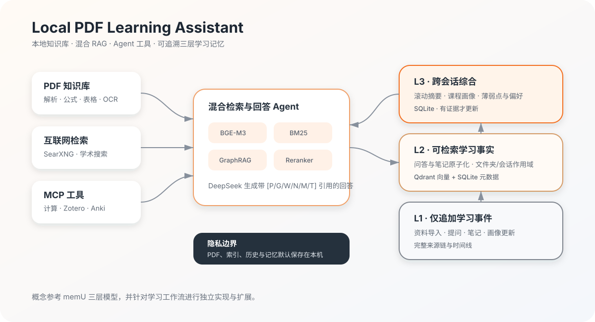

# PDF 学习问答助手

<p align="center">
  <a href="README.md"></a>
  <a href="README.en.md"></a>
</p>

[](https://www.python.org/)
[](LICENSE)
[](https://docs.astral.sh/ruff/)

这是一个面向数学、统计与数据分析学习的本地 PDF 问答应用。项目启动时知识库为空；以后可以随时从网页上传电子版 PDF，系统会自动解析、分块、建立本地向量索引，并使用 DeepSeek 生成带页码引用的回答。

> 一句话介绍：把本地 PDF 变成一个会引用页码、能持续记住学习脉络、还可以调用计算与文献工具的个人学习 Agent。



## 技术栈

| 模块 | 技术 |
| --- | --- |
| Web 界面 | Gradio |
| 大模型与 Agent | DeepSeek（OpenAI-compatible API）、MCP |
| PDF 解析 | PyMuPDF、Tesseract OCR（可选） |
| 向量与混合检索 | BGE-M3、Qdrant、BM25、可选 BGE Reranker |
| 知识图谱 | 本地 Fast GraphRAG（实体共现图） |
| 数据与记忆 | SQLite、Qdrant |
| 联网与学术搜索 | SearXNG、arXiv、OpenAlex、Crossref |
| 学习工具 | Zotero、Anki、Python/SymPy |

## 已实现功能

- 多 PDF 上传、哈希去重与本地持久化
- 文档文件夹：上传时分类，已入库 PDF 可批量移动
- PyMuPDF 电子版 PDF 解析、页码保留和结构化分块
- 公式行、Markdown 表格、页面图像/矢量图检测与中英文 OCR 证据
- 本地 BGE-M3 向量检索 + BM25 关键词检索
- 本地 Fast GraphRAG：概念/公式实体、共现关系、邻居扩展和页码追溯
- 可选 BGE 重排序
- DeepSeek API 问答，回答引用 PDF 页码
- 仅 PDF、PDF + 互联网、仅互联网搜索三种模式
- SearXNG 本地联网搜索接口
- 连续追问自动改写为可独立检索的完整问题
- 历史问答与学习笔记的本地向量记忆检索
- 当前对话/跨对话记忆范围切换
- 文件夹级 PDF、笔记和历史记忆联动
- 按课程（文档文件夹）隔离的学习画像，每次问答后自动推断薄弱点
- 长对话自动压缩摘要，保留早期学习上下文
- PDF、GraphRAG、网页、笔记与历史记忆分别使用 `[P]`/`[G]`/`[W]`/`[N]`/`[M]` 引用
- DeepSeek Agent 工具调用，MCP 结果使用 `[T]` 引用
- 显式 Agent 工具注册表、工具组策略、重复调用保护和最多 4 轮循环调用
- 受限 Python/SymPy 统计计算与公式验证
- arXiv、OpenAlex、Crossref 学术搜索
- 受限学习文件与只读 SQLite 查询
- Zotero 论文库、标签、笔记与引文读取
- Anki 卡片读取、创建、更新与复习日期设置
- 本地 SQLite 问答历史、笔记、会话和学习统计
- 学习回顾以及 Markdown/JSON 报告
- Gradio 本地网页界面

## 快速开始

### 环境要求

当前机器为 Apple M4、16GB 内存。推荐使用 DeepSeek API 负责生成，本机负责 PDF 解析、BGE-M3 嵌入、检索和数据存储。默认嵌入批量为 4，避免占用过多统一内存。

## 1. 安装 Python 3.12

项目支持 Python 3.11-3.13，不建议使用当前系统的 Python 3.14。

```bash
brew install python@3.12
```

确认：

```bash
python3.12 --version
```

## 2. 创建环境并安装

在项目目录执行：

```bash
python3.12 -m venv .venv
source .venv/bin/activate
python -m pip install --upgrade pip
python -m pip install -r requirements.txt
```

首次安装以及首次上传 PDF 时需要联网下载依赖和 BGE-M3 模型，可能需要数分钟。

如果需要运行测试和代码检查，请改用：

```bash
python -m pip install -e ".[dev]"
```

## 3. 配置 DeepSeek

```bash
cp .env.example .env
```

编辑 `.env`：

```dotenv
DEEPSEEK_API_KEY=你的DeepSeek_API_Key
DEEPSEEK_BASE_URL=https://api.deepseek.com
DEEPSEEK_MODEL=deepseek-v4-flash
```

不要把 `.env` 发给别人或提交到 Git。未配置 Key 时，PDF 上传、解析和索引仍然可用，但不能生成回答。

## 4. 启动

终端启动：

```bash
source .venv/bin/activate
PYTHONPATH=src python app.py
```

浏览器会自动打开：

```text
http://127.0.0.1:7860
```

从 GitHub 克隆或下载项目后，先恢复启动脚本的执行权限：

```bash
chmod +x start.command start-search.command
```

安装完成后，直接双击 `start.command`。它会依次启动 Docker Desktop、
SearXNG 联网搜索和 PDF 问答页面，无需再单独点击 `start-search.command`。如果以后安装了
Zotero 或 Anki，它也会自动尝试打开这两款本机服务。

## 5. 使用

1. 打开“知识中心”。
2. 创建或选择文件夹，再选择一份或多份电子版 PDF。
3. 展开“知识库管理”卡片，点击“解析并加入知识中心”。已入库文档可以批量移动。
4. 首次运行会下载 `BAAI/bge-m3`，请等待索引完成。
5. 返回“首页”，通过输入框底部的圆形控制项选择模型、课程、模式、记忆、PDF 和工具；
   不选择 PDF 时默认检索当前课程文件夹中的全部文档。
6. 输入问题，答案会使用 `[P1]`、`[P2]` 标记证据，对应提供的文档和页码。
7. 按 `Enter` 发送问题，按 `Shift + Enter` 在问题中换行。

### 记忆与上下文

- 连续追问会先结合当前对话摘要和最近 4 轮问答改写检索词。
- 选择“仅当前对话”时，长期记忆不会跨会话；选择“参考所有历史”时才会检索其他对话。
- 选择“文件夹上下文”后，PDF 和记忆都会限定在该文件夹。
- 长期记忆向量保存在本地 Qdrant，元数据保存在 SQLite。旧记录在启动时自动迁移。
- 对话超过 4 轮后，每累积 6 轮未压缩的早期内容会触发自动摘要。
- “学习画像”可以手动编辑，也可根据本地历史和笔记自动分析。
- 每个文档文件夹会形成一份独立课程画像；选择单一文件夹或该文件夹中的 PDF 提问时，
  只更新对应课程的画像。系统会谨慎区分“提到过的主题”和“有重复困惑证据的薄弱点”。

## 三层学习记忆架构

本项目的记忆架构在概念上借鉴了开源项目
[NevaMind-AI/memU](https://github.com/NevaMind-AI/memU) 的三层模型：
`Resource → Memory Item → Memory Category`。这里借鉴的是分层、聚合和可追溯的设计思想；
本项目没有把 memU 作为运行依赖，也没有直接复制其实现代码，而是针对 PDF 学习场景完成了独立实现。

| 本项目层级 | 保存内容 | 对应的 memU 思想 | 主要作用 |
| --- | --- | --- | --- |
| L1 · 仅追加学习事件 | 导入资料、完成问答、保存笔记、画像更新 | Resource / 原始来源 | 保留时间线和未经压缩的来源证据 |
| L2 · 可检索学习事实 | 问答、改写后的问题、手动笔记 | Memory Item / 原子记忆 | 以 BGE-M3 写入 Qdrant，按语义恢复相关学习上下文 |
| L3 · 跨会话综合 | 滚动对话摘要、课程画像、薄弱点、解释偏好 | Memory Category / 聚合记忆 | 为长对话和跨会话学习提供稳定、紧凑的高层上下文 |

### 我们针对学习场景做的改进

- **课程隔离**：以 PDF 文件夹作为课程边界，PDF、笔记、历史记忆和画像使用同一作用域。
- **可控跨会话记忆**：用户可以明确选择“仅当前对话”或“参考所有历史”，避免无意混入其他课程。
- **双存储与可重建索引**：SQLite 保存可审计元数据，Qdrant 保存语义向量；索引缺失时可从事实层恢复。
- **渐进式长对话压缩**：保留最近 4 轮原文，只分批压缩较早内容，摘要记录精确覆盖到哪一条问答。
- **有证据的学习画像**：按课程推断薄弱点、解释深度和数学表达偏好，并记录推断依据；证据不足时不武断更新。
- **完整来源链**：L1 事件可以追到 L2 事实，L2 事实可以追到 L3 摘要或课程画像，界面提供三层记忆图谱。
- **记忆与知识证据分离**：记忆只用于恢复学习上下文；最终回答仍优先由 PDF、GraphRAG、网页或工具结果支撑，并使用不同引用标记。

这一映射是学习场景下的重新解释，因此本项目中的 L1/L2/L3 命名不等同于 memU 当前代码中的内部层级编号。

### PDF 公式、表格与页面图像

- 普通正文、公式、表格和页面图像说明分别建立检索片段，并保留原始页码。
- 表格会转成 Markdown，便于 DeepSeek 比较行列、数值和统计量。
- 含嵌入图像、大量矢量图形或扫描内容的页面会渲染到 `data/page_assets`。
- 扫描页使用本机 Tesseract 的 `chi_sim+eng` OCR；可在 `.env` 中用
  `ENABLE_PAGE_OCR=false` 关闭。
- 当前 DeepSeek Chat Completion 接口接收文本内容，因此最终回答使用的是页面文字、
  公式、表格、图题、图形结构统计和 OCR 结果，不会把整本 PDF 上传到云端。

### 本地 GraphRAG

- 在“知识中心”点击“本地 GraphRAG”卡片，再点击“构建 / 重建 GraphRAG”。
- 系统在本机从 PDF 片段提取中英文概念、英文术语和公式实体，并按片段共现建立关系。
- GraphRAG 查询会先匹配问题实体，再沿关系图扩展相邻概念，最后返回原 PDF 和页码。
- 图谱构建不调用云端大模型；普通 PDF 问答会自动合并相关图谱证据，并使用 `[G1]` 引用。
- 上传、移动或增加 PDF 后，GraphRAG 卡片会提示重新构建；原有向量/BM25 检索不受影响。
- 这是面向 M4 16GB 优化的本地 Fast GraphRAG，不等同于 Microsoft 标准的 LLM 重型索引流水线。

### Agent / MCP 工具

- 点击首页输入框底部的 `⌘` 圆形控制项，可以按工具组控制 DeepSeek 能使用哪些能力。
- DeepSeek 根据问题自行决定是否调用工具，最多进行 4 轮“调用—读取结果—继续推理”。
- 工具结果在回答中引用为 `[T1]`、`[T2]`，调用轨迹显示在“本次检索与记忆详情”。
- “仅 PDF”模式会自动取消并禁用全部 MCP 工具，确保答案只使用所选 PDF；切回联网模式时恢复默认工具组。
- Python 在单独的受限子进程中运行，使用模块白名单、代码检查、资源限制和 10 秒超时。
- 文件系统只允许访问 `LEARNING_FILES_ROOT`；默认是 `data/uploads`。
- SQLite 以 `mode=ro` 和 `query_only` 打开，只允许单条 `SELECT`/`WITH` 查询。
- Zotero 工具只读。Anki 写入工具仅在问题明确要求创建、更新或安排卡片时才会执行。

在“学习空间”点击“MCP 服务”卡片，再点击“检测全部 MCP 工具”，可以查看本地 MCP、Zotero 和 Anki 的状态。

### Zotero 接入

当前电脑没有安装 Zotero 时，普通问答和其他工具仍可正常使用。安装 Zotero 后：

1. 打开 Zotero 并在高级设置中启用本地 API。
2. 保持 Zotero 运行。
3. 在“学习空间 → MCP 服务”卡片中点击检测；成功后会显示“Zotero 本地 API 已连接”。

本地模式读取 `http://127.0.0.1:23119/api`，不需要云端 Key。也可以在 `.env` 中填写
`ZOTERO_USER_ID` 和只读的 `ZOTERO_API_KEY`，改用云端库。

### Anki 接入

当前电脑没有安装 Anki 时，其他工具不受影响。安装 Anki 后：

1. 在 Anki 中打开“工具 → 插件 → 获取插件”。
2. 输入 AnkiConnect 插件代码 `2055492159`。
3. 重启并保持 Anki 运行。
4. 在“学习空间 → MCP 服务”卡片中检测；默认连接 `http://127.0.0.1:8765`。

## 6. 联网搜索

平时只需要双击 `start.command`，它会自动启动联网搜索。如果只想单独管理
SearXNG，也可以双击：

```text
start-search.command
```

它会自动启动 Docker Desktop、等待后台服务就绪，然后启动 SearXNG。也可以手动先启动 Docker Desktop，再执行：

```bash
docker compose -f docker-compose.search.yml up -d
```

项目默认使用 SearXNG 官方 GHCR 镜像 `ghcr.io/searxng/searxng:latest`。如果 Docker Hub 在当前网络下超时，GHCR 通常仍可正常下载。默认配置不使用代理；如果你的网络必须经过代理，请参考 `searxng/settings.yml` 中的双语注释，填写可供 Docker 容器访问的代理地址。

检查：

```bash
curl "http://127.0.0.1:8080/search?q=central+limit+theorem&format=json"
```

停止：

```bash
docker compose -f docker-compose.search.yml down
```

SearXNG 只绑定到 `127.0.0.1`，不会主动暴露到局域网或公网。在应用中选择“PDF + 互联网”或“仅互联网搜索”即可使用。

如果界面提示“无法连接本地 SearXNG”，说明 `127.0.0.1:8080` 当前没有可用服务。最常见原因是 Docker Desktop 没有启动；这与 DeepSeek API Key 无关。启动后可在左栏点击“检测联网搜索服务”。

## 7. 数据位置

所有本地数据默认保存在：

```text
data/
├── assistant.sqlite3   # 历史、笔记、文档元数据与 GraphRAG 图谱
├── qdrant/             # 向量索引
├── reports/            # 学习报告
└── uploads/            # 本地 PDF 副本
```

备份整个 `data/` 目录即可备份知识库。使用 DeepSeek API 时，原始 PDF 不会整体上传；应用会发送问题、对话摘要、学习画像和检索出的少量 PDF/网页/笔记/记忆片段。启用学术搜索或网页搜索时，检索词会发送给对应的公开 API 或本机 SearXNG；Zotero 云端模式会把检索词发送给 Zotero API。

## 8. 数学 PDF 说明

当前版本针对带文字层的电子版 PDF。公式能否完整提取取决于 PDF 内部的字体编码：

- 普通 LaTeX 导出的电子版教材和论文通常可以直接解析。
- 如果个别页面公式或表格出现乱码，界面会给出低文本量提醒。
- 扫描版、图片公式以及复杂跨页表格需要后续接入 MinerU/OCR 解析器。

系统不会直接在应用进程或终端中执行模型生成的任意命令。Python 统计工具只在受限子进程中运行允许的数学统计模块；SymPy 公式工具采用单独的表达式白名单。

## 项目结构

```text
.
├── app.py                       # Gradio 启动入口
├── src/pdf_assistant/
│   ├── assistant.py             # 问答编排、记忆与课程画像
│   ├── pdf_parser.py            # PDF、表格、公式与 OCR 解析
│   ├── retrieval.py             # BGE-M3 + BM25 + Reranker
│   ├── graph_rag.py              # 本地实体共现 GraphRAG
│   ├── database.py              # SQLite 数据与三层记忆
│   ├── llm.py                   # DeepSeek 提示词与 Agent 循环
│   ├── mcp_client.py            # MCP 工具注册与调用
│   └── ui.py                    # Gradio 界面
├── tests/                       # 单元测试
├── requirements.txt            # 运行依赖
├── pyproject.toml               # 包信息与开发依赖
└── .env.example                # 环境变量模板
```

## 测试

```bash
source .venv/bin/activate
pytest -q
ruff check .
```

## 常见问题

### 首次上传很慢

首次需要下载 BGE-M3 并在本机加载模型，以后会使用本地缓存。大 PDF 的首次向量化也会花费一定时间。

### DeepSeek 提示未配置

确认 `.env` 位于项目根目录，并且修改后重新启动了应用。

### 联网模式不可用

确认 Docker Desktop 和 SearXNG 已启动，且下面地址可以访问：

```text
http://127.0.0.1:8080
```

### 16GB 内存压力较大

保持 `EMBEDDING_BATCH_SIZE=4`，不要同时运行本地大型语言模型。必要时可以把 `.env` 中的 `EMBEDDING_DEVICE` 改为 `cpu`。

## 开源说明

本项目采用 [MIT License](LICENSE)，另提供[非官方简体中文译文](LICENSE.zh-CN.md)。记忆架构的概念参考
[memU](https://github.com/NevaMind-AI/memU)（Apache-2.0）；本项目的代码与学习场景扩展为独立实现。

欢迎通过 Issue 或 Pull Request 提交建议。请勿在 Issue、日志或截图中上传 API Key、私人 PDF 或本地学习数据。
